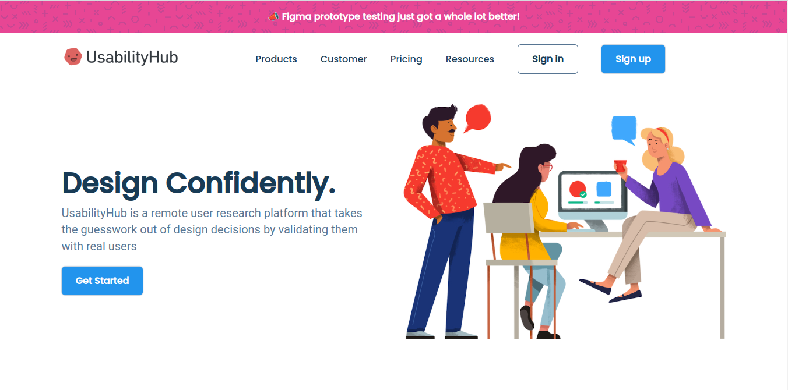
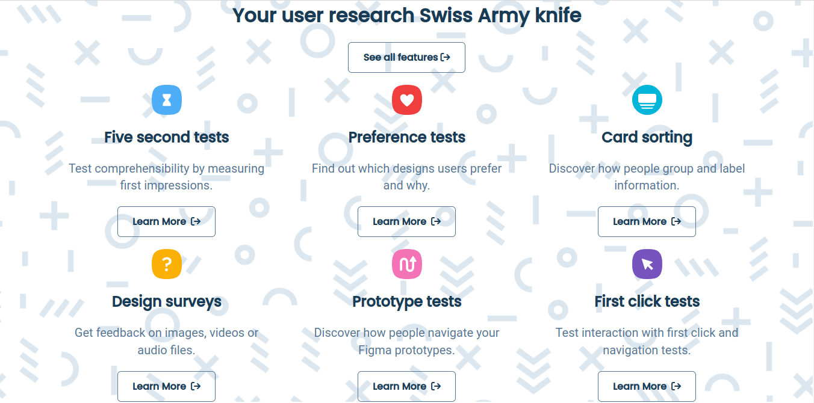
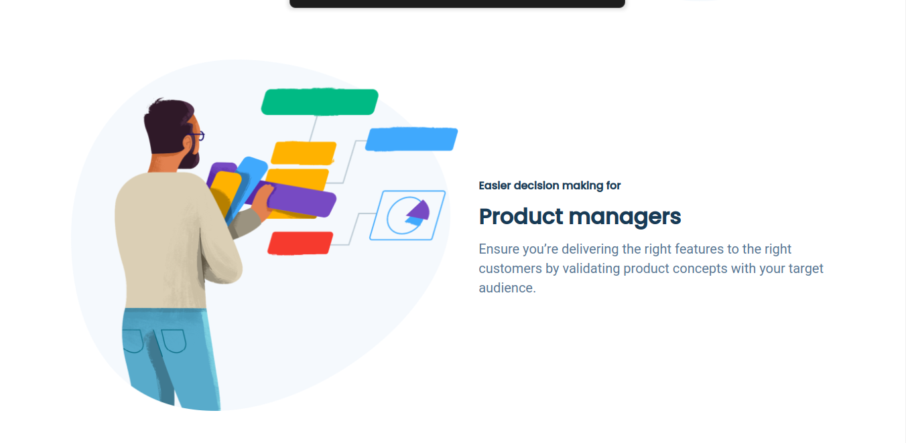
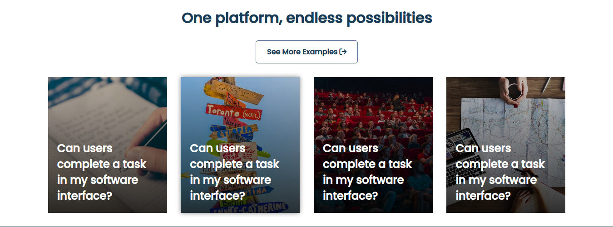
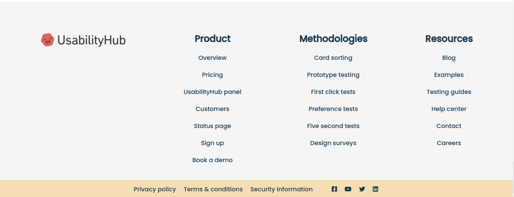

# Responsive Modern Website

Welcome to the Responsive Modern Website repository, where you'll find a stunning and fully responsive website built using HTML, CSS, and JavaScript.

## Description

The Responsive Modern Website is a visually appealing and contemporary web application designed to provide an engaging user experience across different devices. With its responsive design, the website seamlessly adapts to various screen sizes, ensuring optimal viewing and interaction for users.

## Features

- Modern and eye-catching design
- Responsive layout for consistent experience on all devices
- Interactive elements and smooth animations
- Easy navigation and user-friendly interface

## Screenshots

Include screenshots or GIFs showcasing the website's design, layout, and interactive elements.










## Usage

1. Clone the repository:

```bash
git clone https://github.com/your-username/responsive-modern-website.git

🌟 Welcome to the world of our Responsive Modern Website! 🎉✨

Experience the epitome of modern web development with our visually stunning and engaging website. Designed with a focus on user experience, our responsive design ensures that the website seamlessly adapts to different screen sizes, providing an optimal viewing experience on all devices. 💻📱

Prepare to be captivated by our eye-catching design, carefully crafted to leave a lasting impression. The website boasts a perfect blend of modern aesthetics, interactive elements, and smooth animations that bring your content to life. 🎨🌐🔥

Discover a user-friendly interface that allows visitors to effortlessly navigate through the website, ensuring a seamless browsing experience. From intuitive menus to easy-to-use interactive features, we've got you covered. ✨🚀🌟

Underneath the surface, our Responsive Modern Website is built with the power trio of HTML, CSS, and JavaScript. This combination enables dynamic functionality, smooth transitions, and an interactive environment for your visitors to explore. Dive into the realm of web development as you contribute to this exciting project. 💪💻🌟

modern website, responsive design, eye-catching, interactive elements, smooth animations, HTML, CSS, JavaScript, web development, project, user-friendly
